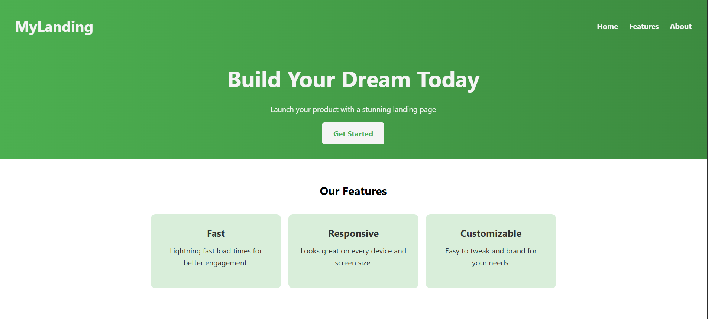

# 🌐 Sample Animated Landing Page with Sass

This is a modern, responsive, and animated landing page built using **HTML** and **Sass (SCSS)**. The project includes:

- Hero section with call-to-action
- Feature cards with animation and links
- About section
- Smooth navigation
- Clean and maintainable Sass architecture

---

## 📁 Folder Structure
```bash
landing-page/
├── index.html
├── fast.html
├── responsive.html
├── customizable.html
├── css/
│   └── main.css
├── scss/
│   ├── _variables.scss
│   ├── _mixins.scss
│   ├── _reset.scss
│   └── main.scss
└── README.md
```
---

## 🛠️ Tech Stack

- HTML5
- Sass (SCSS)
- CSS3 (compiled)
- GitHub Pages (for deployment)

---

## ✨ Features

- 🔥 Responsive layout
- 💨 Smooth animations using keyframes
- 🎯 Section-based navigation with scroll behavior
- 📱 Mobile-first design
- 🧱 Clean and modular Sass files

---

## 📦 Getting Started

### 1. Clone the repo

```bash
git clone https://github.com/your-username/your-repo-name.git
cd your-repo-name
```

### 2. Install Sass (if not installed)

```bash
npm install -g sass
```

### 3. Compile Sass

```bash
sass scss/main.scss css/main.css
```

Or auto-watch changes:

```bash
sass --watch scss/main.scss:css/main.css
```

### 4. Open in browser

```bash
open index.html
```

Or use **Live Server** in VS Code.

---

## 📸 Screenshots



---

## 🤝 License

This project is open-source and free to use. Attribution appreciated!

---
